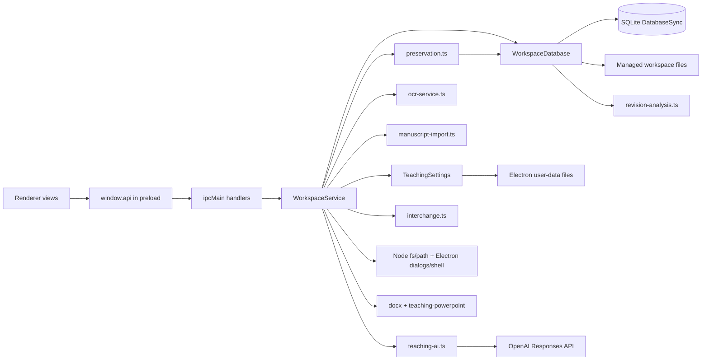

# WorkspaceService + WorkspaceDatabase decomposition audit

This is a read-only audit of the current Research Studio baseline on `mayday2/refactor`.

No production code, schema, IPC contract, renderer behavior, or framework choices were changed as part of this task.

## 1. Executive summary

The current architecture is coherent and preservable, but two classes have become oversized operational hubs:

- `WorkspaceService` is the main-process orchestration façade for almost every feature.
- `WorkspaceDatabase` is the main SQLite persistence façade for almost every feature.

The primary issue is not that the system lacks boundaries. The issue is that many boundaries are implicit and collapsed into these two types.

### Headline findings

- `WorkspaceService` currently exposes **76 public methods** and **4 private helpers**.
- The service currently covers **18 major responsibility groups**.
- `WorkspaceDatabase` currently exposes **69 public methods**, **19 private helpers**, and one large constructor-driven schema bootstrap.
- The database currently covers **12 major persistence responsibility groups**.
- The renderer → preload → main IPC boundary is manually duplicated in three places:
  - `src/shared/domain.ts`
  - `src/preload/index.ts`
  - `src/main/index.ts`
- Several renderer workflows orchestrate backend details through multiple fine-grained IPC calls.
- The current design strongly assumes:
  - a single interactive process
  - a single local SQLite owner
  - same-machine filesystem access
  - process-local cancellation/state

### Overall conclusion

A safe stabilization refactor should start by decomposing `WorkspaceService` into smaller collaborator services before attempting deep `WorkspaceDatabase` separation. Database decomposition should preserve existing transaction boundaries, provenance guarantees, and file-ownership rules.

---

## 2. WorkspaceService responsibility inventory

Source: `src/main/workspace-service.ts`

### 2.1 Owned state and coordination state

`WorkspaceService` currently owns or coordinates:

- `teachingSettings`: persistent AI settings adapter
- `teachingRequest`: process-local `AbortController | null` for at-most-one teaching synthesis
- `database`: active `WorkspaceDatabase | null`
- `preferencesPath`: Electron user-data path for recent workspace persistence
- workspace lifecycle transitions via `open()` / `close()`
- teaching cancellation and workspace-change guards during synthesis

This is a mix of:

- application state
- process-local background work state
- configuration state
- persistence session state

### 2.2 Public method inventory

#### A. Teaching domain

- `cancelTeachingSynthesis()`
- `synthesizeTeachingLesson()`
- `listLessons()`
- `saveLesson()`
- `importTeachingDocuments()`
- `exportLesson()`

#### B. Workspace lifecycle / application state

- `choose()`
- `recent()`
- `close()`

#### C. Sources / citations

- `listSources()`
- `getSource()`
- `saveSource()`
- `removeSource()`
- `importLibrary()`
- `exportLibrary()`

#### D. Source PDFs / document pages / evidence / local OCR

- `attachPdf()`
- `openFile()`
- `pdfData()`
- `listDocumentPageSummaries()`
- `listExcerpts()`
- `saveExcerpt()`
- `removeExcerpt()`
- `saveDocumentPageText()`
- `getDocumentPageText()`
- `ocrPage()`
- `listCodes()`

#### E. Projects / project workspace

- `listProjects()`
- `getProject()`
- `saveProject()`
- `removeProject()`
- `assignProjectSource()`
- `saveProjectGoal()`
- `removeProjectGoal()`
- `saveProjectNote()`
- `removeProjectNote()`
- `importProjectFiles()`
- `importDroppedProjectFiles()`
- `openProjectFile()`
- `revealProjectFile()`
- `removeProjectFile()`
- `exportProject()`

#### F. Manuscripts / revision workflows

- `listManuscripts()`
- `getManuscript()`
- `saveManuscript()`
- `importManuscript()`
- `removeManuscript()`
- `saveManuscriptSection()`
- `removeManuscriptSection()`
- `addManuscriptTrace()`
- `exportManuscript()`
- `getRevisionWorkspace()`
- `importReviewerComments()`
- `analyzeManuscriptRevision()`
- `setRevisionSuggestionStatus()`
- `removeReviewDocument()`

#### G. Interviews / transcripts / qualitative analysis

- `listInterviews()`
- `getInterview()`
- `saveInterview()`
- `removeInterview()`
- `attachInterviewMedia()`
- `openInterviewMedia()`
- `importTranscript()`
- `saveTranscriptSegment()`
- `removeTranscriptSegment()`
- `analyzeInterviews()`
- `listSynthesisMemos()`
- `saveSynthesisMemo()`
- `removeSynthesisMemo()`
- `exportSynthesisMemo()`

#### H. Preservation / discovery

- `checkIntegrity()`
- `createBackup()`
- `restoreBackup()`
- `exportQualitative()`
- `search()`
- `searchIndexStatus()`
- `rebuildSearchIndex()`

### 2.3 Private/internal methods

- `open()`
- `requireDatabase()`
- `citationIdentity()`
- `manuscriptMarkdown()`

### 2.4 Major responsibility groups

The service currently carries these **18 responsibility groups**:

1. teaching AI request lifecycle
2. teaching lesson persistence routing
3. teaching document import/export
4. workspace selection/open/recent persistence
5. workspace database lifetime management
6. source CRUD routing
7. citation library import/export orchestration
8. source PDF attachment/open/read orchestration
9. document-page text persistence routing
10. local OCR dispatch
11. evidence excerpt and codebook routing
12. project CRUD and project assignment routing
13. project goals/notes/file operations and export
14. manuscript CRUD/import/export/traces
15. revision analysis/comment workflow routing
16. interview/media/transcript routing
17. qualitative analysis and synthesis-memo routing
18. preservation and discovery routing

### 2.5 Dependencies

#### Direct imports / concrete dependencies

- Electron:
  - `app`
  - `dialog`
  - `shell`
- document export:
  - `docx` (`Document`, `HeadingLevel`, `Packer`, `Paragraph`, `TextRun`)
- filesystem:
  - `existsSync`
  - `readFileSync`
  - `statSync`
  - `writeFileSync`
- paths:
  - `basename`
  - `extname`
  - `join`
  - `resolve`
- runtime utilities:
  - `randomUUID`
  - `zod`
- persistence:
  - `WorkspaceDatabase`
- validation:
  - all Zod schemas in `validation.ts`
- interchange:
  - `parseLibrary()`
  - `exportLibrary()`
- preservation:
  - `checkWorkspaceIntegrity()`
  - `createWorkspacePackage()`
  - `qualitativeCsv()`
  - `restoreWorkspacePackage()`
- local OCR:
  - `recognizeEnglish()`
- document import:
  - `extractManuscript()`
- teaching/provider:
  - `synthesizeLesson()`
  - `TeachingSettings`
  - `teachingPowerPoint()`
  - `slidesHtml()`

#### Dependency observations

- `WorkspaceService` depends on concrete implementations, not interfaces.
- It directly constructs `WorkspaceDatabase`.
- It directly owns teaching settings rather than receiving them from a collaborator.
- It uses utility modules plus feature modules without an intermediate feature boundary.

### 2.6 Database interactions

Most public methods are thin wrappers around `WorkspaceDatabase`, but many still add orchestration logic before and after database access.

#### Mostly direct pass-through to database

Examples:

- `listSources()`
- `getSource()`
- `saveSource()`
- `removeSource()`
- `listProjects()`
- `getProject()`
- `saveProject()`
- `removeProject()`
- `saveInterview()`
- `search()`
- `rebuildSearchIndex()`

#### Wrapper + validation + database

Examples:

- `saveDocumentPageText()`
- `saveSynthesisMemo()`
- `saveProjectGoal()`
- `saveManuscript()`
- `saveTranscriptSegment()`

#### Wrapper + dialog/filesystem + database

Examples:

- `attachPdf()`
- `importProjectFiles()`
- `attachInterviewMedia()`
- `importTranscript()`
- `importManuscript()`
- `importLibrary()`

#### Wrapper + export formatting + database

Examples:

- `exportProject()`
- `exportManuscript()`
- `exportSynthesisMemo()`
- `exportQualitative()`
- `exportLibrary()`

### 2.7 Filesystem interactions

`WorkspaceService` itself performs direct filesystem work in addition to delegating file storage to `WorkspaceDatabase`.

#### Direct file reads/writes

- reads recent workspace preferences via `readFileSync()`
- writes recent workspace preferences via `writeFileSync()`
- reads imported citation-library files
- reads reviewer-comment files
- reads transcript files
- writes exported project JSON
- writes exported Markdown, DOCX, lesson materials, and qualitative exports

#### Path and metadata checks

- uses `statSync()` for size limits on imported teaching docs, manuscripts, transcript files, and citation libraries
- uses `resolve()` and `extname()` for import/export guards

#### OS-level file actions

- opens PDFs, project files, and interview media via `shell.openPath()`
- reveals project files via `shell.showItemInFolder()`
- uses native open/save dialogs for most import/export flows

### 2.8 AI/provider interactions

The only live provider integration in the service is teaching synthesis.

#### Teaching AI behavior

- reads encrypted credentials from `TeachingSettings`
- creates and owns an `AbortController`
- enforces one in-flight synthesis at a time
- applies a 180-second timeout
- checks whether the workspace changed during synthesis
- calls `synthesizeLesson()` in `teaching-ai.ts`
- returns validated provider output back to the renderer

#### Provider-related risk

This is one of the clearest multi-domain methods because it combines:

- teaching domain logic
- configuration/credential access
- process-local job state
- provider call orchestration
- workspace lifetime safety checks

### 2.9 Renderer / IPC interactions

`WorkspaceService` is the backend target for nearly every `ipcMain.handle()` registration in `src/main/index.ts`.

#### Key observation

The service is effectively the entire main-process application API surface.

That means changes to:

- IPC names
- validation entry points
- dialog behavior
- orchestration order
- return shapes

are all concentrated here.

### 2.10 Configuration and environment dependencies

#### Configuration dependencies

- Electron user-data `preferences.json` for recent workspace path
- Electron user-data `teaching-ai.json` via `TeachingSettings`
- encrypted API-key storage through `safeStorage` indirectly via `TeachingSettings`

#### Environment dependencies

- no feature-specific environment variables are used by the service
- the service does depend on Electron app user-data directories and local OS dialogs

### 2.11 Provenance-related behavior

`WorkspaceService` participates in provenance policy even when the database persists the final records.

Examples:

- teaching synthesis retains provider/model provenance through `synthesizeLesson()`
- manuscript export includes trace notes derived from source/evidence provenance
- citation import stamps provenance notes onto imported sources
- project export includes manuscript revision data and source material relationships
- transcript and reviewer-comment imports preserve original filenames at the orchestration boundary

### 2.12 Error handling behavior

Patterns in the service:

- throws descriptive user-facing `Error`s directly
- uses validation exceptions from Zod as control boundaries
- wraps shell failures with domain-specific messages
- uses workspace-change checks to reject stale operations
- uses boolean / nullable returns to encode dialog cancellation

Observations:

- user-facing copy is embedded directly in service methods
- cancellation is represented partly by `null`/`false` and partly by thrown errors
- there is no centralized error taxonomy or structured logging layer

### 2.13 Long-running or potentially long-running operations

Potentially long operations currently routed through this service:

- `synthesizeTeachingLesson()`
- `importTeachingDocuments()`
- `attachPdf()` for large PDFs
- `pdfData()` for large reads and checksum verification
- `ocrPage()`
- `importProjectFiles()`
- `exportProject()`
- `importManuscript()`
- `exportManuscript()`
- `importReviewerComments()` on large files
- `attachInterviewMedia()`
- `importTranscript()`
- `exportSynthesisMemo()`
- `checkIntegrity()`
- `createBackup()`
- `restoreBackup()`
- `exportQualitative()`
- `rebuildSearchIndex()`
- `importLibrary()`
- `exportLibrary()`

### 2.14 Domain ownership classification by method cluster

| Domain                    | Current methods                                                                                                                                                                                                                                                                                      |
| ------------------------- | ---------------------------------------------------------------------------------------------------------------------------------------------------------------------------------------------------------------------------------------------------------------------------------------------------- |
| Teaching                  | `cancelTeachingSynthesis`, `synthesizeTeachingLesson`, `listLessons`, `saveLesson`, `importTeachingDocuments`, `exportLesson`                                                                                                                                                                        |
| Workspace/application     | `choose`, `recent`, `close`, `open`, `requireDatabase`                                                                                                                                                                                                                                               |
| Sources/citations         | `listSources`, `getSource`, `saveSource`, `removeSource`, `importLibrary`, `exportLibrary`, `citationIdentity`                                                                                                                                                                                       |
| PDFs/documents            | `attachPdf`, `openFile`, `pdfData`, `listDocumentPageSummaries`, `saveDocumentPageText`, `getDocumentPageText`, `ocrPage`                                                                                                                                                                            |
| Evidence/provenance/codes | `listExcerpts`, `saveExcerpt`, `removeExcerpt`, `listCodes`, `manuscriptMarkdown`                                                                                                                                                                                                                    |
| Projects                  | `listProjects`, `getProject`, `saveProject`, `removeProject`, `assignProjectSource`, `saveProjectGoal`, `removeProjectGoal`, `saveProjectNote`, `removeProjectNote`, `importProjectFiles`, `importDroppedProjectFiles`, `openProjectFile`, `revealProjectFile`, `removeProjectFile`, `exportProject` |
| Manuscripts               | `listManuscripts`, `getManuscript`, `saveManuscript`, `importManuscript`, `removeManuscript`, `saveManuscriptSection`, `removeManuscriptSection`, `addManuscriptTrace`, `exportManuscript`                                                                                                           |
| Revisions                 | `getRevisionWorkspace`, `importReviewerComments`, `analyzeManuscriptRevision`, `setRevisionSuggestionStatus`, `removeReviewDocument`                                                                                                                                                                 |
| Interviews/transcripts    | `listInterviews`, `getInterview`, `saveInterview`, `removeInterview`, `attachInterviewMedia`, `openInterviewMedia`, `importTranscript`, `saveTranscriptSegment`, `removeTranscriptSegment`                                                                                                           |
| Qualitative analysis      | `analyzeInterviews`, `listSynthesisMemos`, `saveSynthesisMemo`, `removeSynthesisMemo`, `exportSynthesisMemo`                                                                                                                                                                                         |
| Preservation              | `checkIntegrity`, `createBackup`, `restoreBackup`, `exportQualitative`                                                                                                                                                                                                                               |
| Discovery                 | `search`, `searchIndexStatus`, `rebuildSearchIndex`                                                                                                                                                                                                                                                  |

### 2.15 Methods that combine multiple domains

These methods are the strongest decomposition hot spots.

#### High-combination methods

- `synthesizeTeachingLesson()`
  - teaching + AI/provider + configuration + job state + workspace lifetime
- `importTeachingDocuments()`
  - teaching + filesystem + manuscript/document parser reuse
- `exportLesson()`
  - teaching + export formatting + filesystem + PowerPoint generation
- `attachPdf()`
  - source domain + filesystem + managed storage
- `openFile()` / `pdfData()`
  - source domain + managed storage + provenance/checksum enforcement
- `saveExcerpt()`
  - evidence + provenance + qualitative codebook
- `importProjectFiles()`
  - project domain + managed storage + checksum dedupe + filesystem
- `removeProjectFile()`
  - project domain + managed storage + deletion policy
- `exportProject()`
  - projects + sources + manuscripts + revisions + JSON export
- `importManuscript()`
  - manuscripts + filesystem + document parsing + revision side-effects
- `exportManuscript()`
  - manuscripts + provenance formatting + Markdown/DOCX generation + filesystem
- `attachInterviewMedia()`
  - interviews + managed storage + filesystem
- `importTranscript()`
  - interviews + filesystem + transcript parsing
- `exportSynthesisMemo()`
  - qualitative analysis + provenance formatting + filesystem
- `createBackup()` / `restoreBackup()`
  - preservation + dialogs + database lifecycle + filesystem
- `exportQualitative()`
  - preservation + interview analysis data + export formatting
- `importLibrary()`
  - sources + provenance + citation interchange + dedupe policy

### 2.16 Monolithic-service assessment

`WorkspaceService` is functioning as:

- workspace lifecycle manager
- application façade
- dialog service
- import/export coordinator
- provider gateway
- filesystem adapter
- serialization/export formatter
- validation entry layer
- background-job state holder

That is a workable baseline, but it is too much responsibility for one class if multiple contributors need safe parallel change boundaries.

---

## 3. WorkspaceDatabase responsibility inventory

Source: `src/main/database.ts`

### 3.1 Constructor and initialization responsibilities

The constructor currently:

- resolves the workspace path
- creates `.research-studio`
- creates `files/`, `interview-media/`, and `project-files/`
- opens the SQLite database file directly via `DatabaseSync`
- enables foreign keys
- enables WAL mode
- runs schema migration bootstrap

This means the class is both:

- database connection owner
- storage-root initializer
- schema bootstrapper

### 3.2 Public method inventory

#### A. Workspace / schema / maintenance

- `constructor`
- `close()`
- `info()`
- `schemaVersion()`
- `integrityCheck()`
- `createSnapshot()`
- `managedFileInventory()`
- `resolveStoredFile()`
- `qualitativeExportData()`

#### B. Teaching persistence

- `listLessons()`
- `saveLesson()`

#### C. Document pages / search / discovery

- `listDocumentPageSummaries()`
- `saveDocumentPageText()`
- `getDocumentPageText()`
- `searchIndexStatus()`
- `rebuildSearchIndex()`
- `search()`

#### D. Sources / evidence / local codebook

- `listSources()`
- `getSource()`
- `saveSource()`
- `removeSource()`
- `attachPdf()`
- `filePath()`
- `pdfData()`
- `listExcerpts()`
- `saveExcerpt()`
- `removeExcerpt()`
- `listCodes()`

#### E. Projects / project files / project export

- `listProjects()`
- `getProject()`
- `saveProject()`
- `removeProject()`
- `assignProjectSource()`
- `saveProjectGoal()`
- `removeProjectGoal()`
- `saveProjectNote()`
- `removeProjectNote()`
- `importProjectFiles()`
- `projectFilePath()`
- `removeProjectFile()`
- `projectExport()`

#### F. Manuscripts / revisions / traces

- `listManuscripts()`
- `getManuscript()`
- `saveManuscript()`
- `importManuscript()`
- `importManuscriptWithReviewNotes()`
- `removeManuscript()`
- `saveManuscriptSection()`
- `removeManuscriptSection()`
- `getRevisionWorkspace()`
- `importReviewDocument()`
- `analyzeManuscriptRevision()`
- `setRevisionSuggestionStatus()`
- `removeReviewDocument()`
- `addManuscriptTrace()`

#### G. Interviews / transcripts / qualitative analysis

- `listInterviews()`
- `getInterview()`
- `saveInterview()`
- `removeInterview()`
- `attachInterviewMedia()`
- `interviewMediaPath()`
- `saveTranscriptSegment()`
- `removeTranscriptSegment()`
- `analyzeInterviews()`
- `listSynthesisMemos()`
- `getSynthesisMemo()`
- `saveSynthesisMemo()`
- `removeSynthesisMemo()`
- `importTranscript()`

### 3.3 Private/internal helper inventory

#### Path, search, and transaction helpers

- `resolveManagedPath()`
- `escapeLike()`
- `resolveInterviewMediaPath()`
- `resolveProjectFilePath()`
- `touchProject()`
- `migrate()`
- `transaction()`

#### Revision helper

- `insertRevisionProposal()`

#### Hydration helpers

- `hydrateProjectFile()`
- `hydrateSource()`
- `hydrateExcerpt()`
- `hydrateProjectSummary()`
- `hydrateGoal()`
- `hydrateManuscript()`
- `hydrateManuscriptSection()`
- `hydrateInterview()`
- `hydrateTranscriptSegment()`
- `hydrateCodedPassage()`
- `hydrateSynthesisMemo()`

### 3.4 Schema/table responsibility inventory

The database class currently spans these table families.

#### Workspace and migration state

- `workspace`
- `schema_migrations`

#### Source library and citations

- `sources`
- `people`
- `source_people`
- `tags`
- `source_tags`
- `source_files`

#### Evidence and local qualitative codes

- `evidence_excerpts`
- `evidence_excerpt_codes`
- `qualitative_codes`

#### Projects and project organization

- `projects`
- `project_sources`
- `goals`
- `project_notes`
- `project_managed_files`
- `project_file_links`

#### Manuscripts and traces

- `manuscripts`
- `manuscript_sections`
- `manuscript_traces`

#### Reviewer and revision analysis

- `review_documents`
- `reviewer_comments`
- `revision_suggestions`

#### Interviews and transcripts

- `interviews`
- `transcripts`
- `interview_media`
- `transcript_segments`
- `transcript_segment_codes`

#### Qualitative synthesis

- `synthesis_memos`
- `synthesis_memo_segments`

#### Discovery / local document intelligence

- `document_pages`
- `search_index`
- `search_index_state`
- search dirty triggers

#### Teaching

- `teaching_lessons`

#### Provisional legacy/future schema still in scope

- `documents`
- `annotations`
- `relationships`
- `agent_observations`

Even when some tables are minimally used today, `WorkspaceDatabase` remains their owner because it owns migration and overall schema responsibility.

### 3.5 Persistence responsibility groups

The database currently covers these **12 major persistence responsibility groups**:

1. workspace metadata and schema migration
2. SQLite connection and transaction management
3. managed storage-root creation and path safety
4. teaching lesson persistence
5. source/citation persistence
6. source PDF and document-page persistence
7. evidence excerpt, codebook, and provenance persistence
8. project/goals/notes/source-link/project-file persistence
9. manuscript/trace persistence
10. revision/reviewer-comment persistence
11. interview/transcript/media/synthesis persistence
12. discovery/index/export/integrity support persistence

### 3.6 Query methods vs mutation methods

#### Mostly query/read-model methods

- `info()`
- `schemaVersion()`
- `managedFileInventory()`
- `qualitativeExportData()`
- `listDocumentPageSummaries()`
- `getDocumentPageText()`
- `searchIndexStatus()`
- `search()`
- `listSources()`
- `getSource()`
- `filePath()`
- `pdfData()`
- `listExcerpts()`
- `listCodes()`
- `listProjects()`
- `getProject()`
- `projectFilePath()`
- `projectExport()`
- `listManuscripts()`
- `getManuscript()`
- `getRevisionWorkspace()`
- `listInterviews()`
- `getInterview()`
- `analyzeInterviews()`
- `listSynthesisMemos()`
- `getSynthesisMemo()`

#### Mostly mutation/write methods

- `saveLesson()`
- `saveDocumentPageText()`
- `rebuildSearchIndex()`
- `saveSource()`
- `removeSource()`
- `attachPdf()`
- `saveExcerpt()`
- `removeExcerpt()`
- `saveProject()`
- `removeProject()`
- `assignProjectSource()`
- `saveProjectGoal()`
- `removeProjectGoal()`
- `saveProjectNote()`
- `removeProjectNote()`
- `importProjectFiles()`
- `removeProjectFile()`
- `saveManuscript()`
- `importManuscript()`
- `importManuscriptWithReviewNotes()`
- `removeManuscript()`
- `saveManuscriptSection()`
- `removeManuscriptSection()`
- `importReviewDocument()`
- `analyzeManuscriptRevision()`
- `setRevisionSuggestionStatus()`
- `removeReviewDocument()`
- `addManuscriptTrace()`
- `saveInterview()`
- `removeInterview()`
- `attachInterviewMedia()`
- `saveTranscriptSegment()`
- `removeTranscriptSegment()`
- `saveSynthesisMemo()`
- `removeSynthesisMemo()`
- `importTranscript()`

### 3.7 Transaction handling

The class owns its own transaction helper:

- `transaction(action)` uses `BEGIN IMMEDIATE` / `COMMIT` / `ROLLBACK`

Observed transactional use cases include:

- search index rebuild
- source save/delete
- evidence save
- project delete
- project file import
- manuscript import
- manuscript import with separated review notes
- review document import
- manuscript re-analysis
- interview create/delete
- transcript segment save
- synthesis memo save
- transcript import
- migration application

#### Transaction observations

- many operations already rely on multi-table guarantees
- some operations intentionally pair DB changes with filesystem changes, but file deletion often happens after commit as best-effort cleanup
- this creates a critical extraction constraint: repository boundaries must not lose existing atomicity where the DB is the system of record

### 3.8 Domain-specific persistence assessment

#### Sources / citations

Responsibilities include:

- source records
- authors/people rows
- source-tag normalization
- source-file registration
- source deletion rules involving manuscripts and legacy annotations

#### PDFs / document pages / evidence

Responsibilities include:

- managed PDF copy registration
- checksum verification
- document page text upsert and overwrite rules
- evidence excerpt provenance JSON construction
- shared codebook maintenance for excerpts

#### Projects

Responsibilities include:

- project summaries/read models
- source membership
- goal persistence
- note persistence
- project-managed-file dedupe, linking, unlinking, deletion
- project export aggregation

#### Manuscripts / revisions

Responsibilities include:

- manuscript and section persistence
- default section creation
- manuscript import with reviewer-note side effects
- trace persistence linked to evidence or source only
- revision workspace read model
- reviewer-comment dedupe by checksum
- deterministic revision suggestion persistence lifecycle

#### Interviews / qualitative analysis

Responsibilities include:

- interview records
- transcript initialization and import
- interview media registration and cleanup
- transcript segment + code persistence
- interview analysis read models
- synthesis memo + linked segment persistence

#### Discovery / search

Responsibilities include:

- page summaries
- FTS index rebuild across many domain tables
- search query tokenization and result mapping
- search dirty state maintenance via schema triggers

#### Preservation support

Responsibilities include:

- live snapshot creation
- managed file inventory for integrity/backup
- path resolution helpers used by preservation logic
- export payload assembly for qualitative data

#### Teaching persistence

Responsibilities include:

- serialized lesson storage as JSON in SQLite

### 3.9 Provenance persistence

The database layer directly persists provenance-related data in several places:

- `saveExcerpt()` writes `locator_json` and `provenance_json`
- `saveDocumentPageText()` retains extraction method, language, confidence, file checksum, timestamps
- `attachPdf()` and `attachInterviewMedia()` retain original name, relative path, byte size, checksum, import time
- `importProjectFiles()` retains original path and checksum-addressed managed copy information
- `addManuscriptTrace()` links prose markers to source/evidence provenance
- `saveSynthesisMemo()` preserves links to transcript passages rather than copying derived evidence into prose

This provenance logic is spread across multiple domains and is not isolated into a single persistence concern.

### 3.10 Configuration/state persistence

The database stores:

- workspace metadata
- teaching lessons
- derived search-index state

The database does **not** store:

- recent workspace preference
- teaching API key or AI settings file

Those remain outside the workspace DB in Electron user-data storage.

### 3.11 Methods that are acting as multi-domain persistence coordinators

These are the strongest signs that `WorkspaceDatabase` is a monolithic persistence layer rather than a set of separated repositories.

#### Cross-domain coordinators

- `rebuildSearchIndex()`
  - reads sources, pages, excerpts, transcript segments, memos, manuscripts
- `removeSource()`
  - checks manuscript traces and legacy annotations, deletes excerpts, deletes source, deletes orphaned people, removes managed files
- `saveExcerpt()`
  - validates source-file relation, persists provenance JSON, creates/reuses qualitative codes, links codes
- `getProject()`
  - aggregates project summary, goals, notes, evidence, source ids, and managed files
- `importProjectFiles()`
  - validates absolute paths, computes checksums, deduplicates managed files, inserts links, manages cleanup on failure
- `projectExport()`
  - aggregates projects, sources, manuscripts, and revision workspaces
- `importManuscriptWithReviewNotes()`
  - persists manuscript content and review-analysis side effects in one transaction
- `analyzeManuscriptRevision()`
  - reads manuscript + prior review data, recomputes reviewer/manuscript-rule proposals, mutates multiple revision tables
- `addManuscriptTrace()`
  - coordinates manuscripts, sources, evidence
- `saveInterview()`
  - persists interview and auto-creates transcript row
- `saveTranscriptSegment()`
  - persists segment, manages shared codebook links, resets transcript content, mutates interview status
- `analyzeInterviews()`
  - performs read-model aggregation across interviews, transcripts, codes
- `saveSynthesisMemo()`
  - validates linked passages against project boundaries, writes memo and join rows
- `importTranscript()`
  - parses content blocks into ordered segments and mutates interview status

### 3.12 Monolithic-persistence assessment

`WorkspaceDatabase` is currently functioning as:

- schema manager
- transaction manager
- repository set for many domains
- managed-file registry
- file-safety policy enforcer
- provenance persistence layer
- search indexer
- export read-model generator
- domain aggregate hydrator

This is the most important monolithic persistence hotspot in the current codebase.

---

## 4. Dependency and caller map

### 4.1 Who calls `WorkspaceService`

#### Direct code callers

- `src/main/index.ts`
  - constructs the single instance
  - registers nearly all IPC handlers against it

#### Indirect callers via IPC

Renderer workflows ultimately call it through `window.api` in:

- `src/renderer/src/App.tsx`
- `src/renderer/src/components/PdfReader.tsx`
- `src/renderer/src/components/DocumentPreparation.tsx`
- `src/renderer/src/components/ProjectsView.tsx`
- `src/renderer/src/components/ManuscriptEditor.tsx`
- `src/renderer/src/components/RevisionPanel.tsx`
- `src/renderer/src/components/InterviewsView.tsx`
- `src/renderer/src/components/AnalysisView.tsx`
- `src/renderer/src/components/DiscoveryView.tsx`
- `src/renderer/src/components/PreservationView.tsx`
- `src/renderer/src/components/TeachingView.tsx`

#### Dependency direction

- No other main-process service currently depends on `WorkspaceService`.
- It is the top of the main-process feature call tree.

### 4.2 What `WorkspaceService` calls

Primary downstream dependencies:

- `WorkspaceDatabase`
- `TeachingSettings`
- `synthesizeLesson()`
- `extractManuscript()`
- `recognizeEnglish()`
- preservation helpers in `preservation.ts`
- citation interchange helpers in `interchange.ts`
- Electron dialogs and shell APIs
- filesystem read/write functions
- `docx` and PowerPoint export helpers

### 4.3 Who calls `WorkspaceDatabase`

#### Direct callers

- `WorkspaceService`
- `preservation.ts`
- tests in `database.test.ts`, `preservation.test.ts`, `teaching.test.ts`

#### Dependency direction

- `WorkspaceDatabase` is a foundational dependency for feature orchestration and preservation.
- It is not called directly by the renderer.

### 4.4 What `WorkspaceDatabase` calls

- Node `DatabaseSync`
- filesystem copy/read/delete/stat helpers
- checksum utilities
- migration list in `migrations.ts`
- revision-analysis utilities:
  - `manuscriptRuleProposals()`
  - `parseReviewerComments()`
  - `reviewerCommentProposals()`

### 4.5 IPC handler dependency map

Every named `ipcMain.handle()` in `src/main/index.ts` depends either on:

- `WorkspaceService` directly, or
- `WorkspaceService.teachingSettings` directly for AI settings persistence

That is the full main-process application API boundary today.

### 4.6 Renderer workflow dependency map

#### App shell

`App.tsx` depends on:

- workspace lifecycle
- source listing/get/save/remove
- citation import/export
- discovery result routing

#### PDF reader workflow

`PdfReader.tsx` depends on:

- PDF bytes
- page text persistence
- OCR page execution
- evidence CRUD
- source file opening

#### Document preparation workflow

`DocumentPreparation.tsx` depends on:

- page text reads/writes
- OCR page execution
- PDF.js renderer-side extraction

#### Projects workflow

`ProjectsView.tsx` depends on:

- project CRUD
- project/source linking
- goal/note CRUD
- project file import/open/reveal/remove
- project export
- source listing
- drag-drop local path extraction

#### Manuscript workflow

`ManuscriptEditor.tsx` depends on:

- manuscript CRUD
- manuscript section CRUD
- trace creation
- manuscript export
- project context
- revision sub-workflow
- lifecycle flush hook

#### Revision workflow

`RevisionPanel.tsx` depends on:

- revision workspace reads
- reviewer comment import
- manuscript analysis
- suggestion status updates
- review-document deletion
- manuscript flush callback provided by the renderer

#### Interview workflow

`InterviewsView.tsx` depends on:

- interview CRUD
- media attach/open
- transcript import
- transcript segment CRUD
- project listing for assignment

#### Analysis workflow

`AnalysisView.tsx` depends on:

- interview analysis
- synthesis memo CRUD/export
- project listing

#### Discovery workflow

`DiscoveryView.tsx` depends on:

- search
- index status
- rebuild index
- result routing handled by `App.tsx`

#### Preservation workflow

`PreservationView.tsx` depends on:

- integrity check
- backup
- restore
- qualitative export

#### Teaching workflow

`TeachingView.tsx` depends on:

- lesson list/save
- lesson import/export
- AI settings
- teaching synthesis
- source listing
- prepared page reads
- excerpt reads
- lifecycle flush hook

### 4.7 Tight-coupling observations

#### Tight but not circular

No hard code-level circular dependency was found between `WorkspaceService` and `WorkspaceDatabase`.

However, there is very tight structural coupling:

- `WorkspaceService` assumes direct access to nearly the entire `WorkspaceDatabase` surface.
- renderer components assume specific fine-grained `window.api` shapes.
- `src/main/index.ts` assumes explicit one-handler-per-method wiring.
- `src/preload/index.ts` mirrors that wiring manually.

#### Functional coupling hot spots

- teaching workflow spans renderer + service + teaching settings + provider call + database
- manuscript workflow spans renderer autosave + revision workflow + export formatting + database
- project export spans projects + sources + manuscripts + revisions
- search rebuild spans nearly every content domain

### 4.8 Mermaid dependency map

### 4.9 Plain-English explanation

The dependency graph is layered, but the layers are broad:

- renderer views call feature groups on `window.api`
- preload mirrors those feature groups into IPC invocations
- main registers one IPC handler per operation
- almost all handlers forward to `WorkspaceService`
- `WorkspaceService` either calls `WorkspaceDatabase` or coordinates supporting modules
- `WorkspaceDatabase` owns SQLite plus managed-file registration and many read-model aggregations

The coupling problem is mostly breadth, not directionality.

---

## 5. IPC duplication findings

### 5.1 Manual duplication of the API surface

The same application API is manually represented in three places:

1. `ResearchStudioApi` in `src/shared/domain.ts`
2. `api` object in `src/preload/index.ts`
3. `ipcMain.handle()` registrations in `src/main/index.ts`

This means every new operation currently requires coordinated edits in three files.

### 5.2 Duplicated handler families

Nearly every feature family is duplicated as:

- a typed interface entry
- a preload invoke wrapper
- a main-process handler registration
- a service method

This is not wrong, but it is repetitive and drift-prone.

### 5.3 Inconsistent naming patterns

Examples of uneven naming:

- `sources:open-file` vs `projects:open-file` vs `interviews:open-media`
- `teaching:import` vs `sources:import-library` vs `interviews:import-transcript`
- `discovery:rebuild` returns status directly, while other exports usually return `boolean` or `count`
- `projects:remove-file` can either unlink or delete managed bytes, which is more than the name suggests
- `reader:save-page-text` and `reader:get-page-text` are low-level persistence names surfaced directly to the renderer

### 5.4 Similar operations using different IPC patterns

Examples:

- exports return different shapes:
  - `boolean`
  - `number | null`
  - full aggregate objects
- imports return different shapes:
  - `null` on cancel
  - detailed summary objects
  - full domain aggregate objects
- some remove operations return nothing
- some remove operations require a follow-up `get()` in the renderer to refresh state

This makes the API understandable, but less uniform than it could be.

### 5.5 Backend workflows currently orchestrated by the renderer

#### Teaching source assembly

`TeachingView.tsx` assembles lesson source text by calling:

- `sources.list()`
- `reader.listPageSummaries()`
- `reader.getPageText()`
- `reader.listExcerpts()`

This means the renderer knows how teaching input is composed from research records.

#### Document preparation

`PdfReader.tsx` and `DocumentPreparation.tsx` orchestrate:

- when page text is extracted
- when OCR is invoked
- when page text is saved
- how coverage is reconstructed

The renderer therefore understands low-level document preparation mechanics.

#### Manuscript autosave

`ManuscriptEditor.tsx` decides:

- whether section data is dirty
- whether manuscript metadata is dirty
- when to call `saveSection()` vs `save()`
- when to refresh current state

This is domain workflow logic in the renderer rather than a single application-level operation.

#### Revision workflow gating

`RevisionPanel.tsx` must call a renderer-provided `flushDraft()` before review actions. The review workflow therefore depends on renderer orchestration and manuscript editor state.

#### Project view refresh patterns

`ProjectsView.tsx` often performs multiple calls like:

- remove goal → fetch project again
- remove note → fetch project again
- import files → refresh lists again

That indicates a fine-grained IPC surface where some domain-level refresh orchestration is pushed to the UI.

### 5.6 Renderer code that knows too much about backend implementation

Examples:

- `ProjectsView.tsx` uses `window.api.files.pathForDrop(file)` to extract absolute local paths for backend import
- `TeachingView.tsx` knows that prepared PDF pages and excerpts must be collected separately
- `PdfReader.tsx` knows that saving page text can be skipped in some cases and that OCR results should be persisted page-by-page
- `ManuscriptEditor.tsx` knows trace insertion rules and formats citation markers itself
- `DiscoveryView.tsx` does `search()` and then separately requests `status()` rather than relying on a single domain-level response

### 5.7 IPC handlers containing business logic

Most handlers in `src/main/index.ts` are thin, but business logic exists in the routing surface through what is and is not routed via `WorkspaceService`.

Example:

- `teaching:ai-settings` and `teaching:save-ai-settings` bypass dedicated `WorkspaceService` methods and directly expose `workspaceService.teachingSettings.get/save`

That slightly weakens the single-façade rule used elsewhere.

### 5.8 Cases where multiple IPC calls could eventually become one domain-level operation

Without changing anything now, the following clusters are clear candidates for future consolidation:

- teaching source assembly from source metadata + prepared pages + excerpts
- manuscript flush/save of section + metadata together
- project update flows that mutate and then re-read aggregates
- document preparation batch execution
- discovery search + status refresh
- revision actions that require manuscript flush before analysis/import

### 5.9 IPC audit conclusion

The IPC layer is explicit and understandable, but verbose, duplicated, and highly method-shaped. It mirrors internal implementation details more closely than domain operations in several workflows.

---

## 6. Proposed service boundaries for eventual `WorkspaceService` decomposition

These are code-following boundaries, not a greenfield redesign.

### 6.1 Workspace lifecycle service

#### Responsibilities

- choose/open/reopen/close active workspace
- own active `WorkspaceDatabase`
- persist recent workspace path
- guard stale-workspace operations

#### Likely methods

- `choose`
- `recent`
- `close`
- `open`
- `requireDatabase`

#### Dependencies

- Electron `dialog`
- Electron `app`
- filesystem JSON read/write
- `WorkspaceDatabase`

#### Communicates with

- all domain services that need the active database/session

#### Extraction risk

- **Medium**
- it is foundational; mistakes could break every feature by invalidating session state

### 6.2 Teaching service

#### Responsibilities

- lesson list/save/import/export
- AI settings access
- teaching synthesis lifecycle and cancellation
- teaching document ingestion from local files

#### Likely methods

- `cancelTeachingSynthesis`
- `synthesizeTeachingLesson`
- `listLessons`
- `saveLesson`
- `importTeachingDocuments`
- `exportLesson`

#### Dependencies

- `WorkspaceDatabase`
- `TeachingSettings`
- `synthesizeLesson`
- `extractManuscript`
- `teachingPowerPoint`
- `slidesHtml`
- Electron dialogs
- filesystem IO

#### Communicates with

- workspace lifecycle service for database access
- possibly source/document service later for teaching-source assembly

#### Extraction risk

- **Medium**
- self-contained, but touches provider calls, secure config, timeouts, and exported artifacts

### 6.3 Source library service

#### Responsibilities

- source CRUD
- citation import/export
- source-level provenance notes

#### Likely methods

- `listSources`
- `getSource`
- `saveSource`
- `removeSource`
- `importLibrary`
- `exportLibrary`
- `citationIdentity`

#### Dependencies

- `WorkspaceDatabase`
- `parseLibrary`
- `exportLibrary`
- Zod validation
- Electron dialogs
- filesystem IO

#### Communicates with

- workspace lifecycle service
- document/evidence service for attached PDF behaviors

#### Extraction risk

- **Medium**
- import/export behavior and duplicate detection are user-visible

### 6.4 Document and evidence service

#### Responsibilities

- source PDF attach/open/read
- page-text persistence routing
- OCR dispatch
- evidence excerpt CRUD
- shared qualitative code listing for evidence/transcript use

#### Likely methods

- `attachPdf`
- `openFile`
- `pdfData`
- `listDocumentPageSummaries`
- `saveDocumentPageText`
- `getDocumentPageText`
- `ocrPage`
- `listExcerpts`
- `saveExcerpt`
- `removeExcerpt`
- `listCodes`

#### Dependencies

- `WorkspaceDatabase`
- Electron dialogs/shell
- local OCR service

#### Communicates with

- source library service
- teaching service
- manuscript service
- discovery service indirectly through DB

#### Extraction risk

- **High**
- provenance, checksum enforcement, and renderer document workflows are sensitive to small behavioral changes

### 6.5 Project workspace service

#### Responsibilities

- project CRUD
- source assignment
- goals and notes
- project file import/open/reveal/remove
- project export

#### Likely methods

- `listProjects`
- `getProject`
- `saveProject`
- `removeProject`
- `assignProjectSource`
- `saveProjectGoal`
- `removeProjectGoal`
- `saveProjectNote`
- `removeProjectNote`
- `importProjectFiles`
- `importDroppedProjectFiles`
- `openProjectFile`
- `revealProjectFile`
- `removeProjectFile`
- `exportProject`

#### Dependencies

- `WorkspaceDatabase`
- Electron dialogs/shell
- filesystem IO for export

#### Communicates with

- source library service
- manuscript/revision service

#### Extraction risk

- **Medium**
- project export and file-link/delete behavior are multi-domain and user-visible

### 6.6 Manuscript and revision service

#### Responsibilities

- manuscript CRUD
- section operations
- document import
- trace insertion
- manuscript export
- revision workspace import/analyze/status/remove flows

#### Likely methods

- `listManuscripts`
- `getManuscript`
- `saveManuscript`
- `importManuscript`
- `removeManuscript`
- `saveManuscriptSection`
- `removeManuscriptSection`
- `addManuscriptTrace`
- `exportManuscript`
- `getRevisionWorkspace`
- `importReviewerComments`
- `analyzeManuscriptRevision`
- `setRevisionSuggestionStatus`
- `removeReviewDocument`
- `manuscriptMarkdown`

#### Dependencies

- `WorkspaceDatabase`
- `extractManuscript`
- `docx`
- filesystem IO
- Electron dialogs

#### Communicates with

- project workspace service
- source/document service

#### Extraction risk

- **High**
- autosave expectations, trace fidelity, reviewer-note separation, and export semantics are delicate

### 6.7 Interview and qualitative-analysis service

#### Responsibilities

- interview CRUD
- media attach/open
- transcript import/segment editing
- cross-interview analysis
- synthesis memo CRUD/export

#### Likely methods

- `listInterviews`
- `getInterview`
- `saveInterview`
- `removeInterview`
- `attachInterviewMedia`
- `openInterviewMedia`
- `importTranscript`
- `saveTranscriptSegment`
- `removeTranscriptSegment`
- `analyzeInterviews`
- `listSynthesisMemos`
- `saveSynthesisMemo`
- `removeSynthesisMemo`
- `exportSynthesisMemo`

#### Dependencies

- `WorkspaceDatabase`
- Electron dialogs/shell
- filesystem IO

#### Communicates with

- project workspace service
- preservation service

#### Extraction risk

- **Medium**
- transcript/code persistence and memo project-scope rules must remain exact

### 6.8 Discovery service

#### Responsibilities

- search
- index status
- rebuild index

#### Likely methods

- `search`
- `searchIndexStatus`
- `rebuildSearchIndex`

#### Dependencies

- `WorkspaceDatabase`

#### Communicates with

- all content domains indirectly through the database

#### Extraction risk

- **Low** at the service layer, **High** if it triggers DB/index behavior changes

### 6.9 Preservation service

#### Responsibilities

- integrity check
- backup
- restore
- qualitative export

#### Likely methods

- `checkIntegrity`
- `createBackup`
- `restoreBackup`
- `exportQualitative`

#### Dependencies

- `WorkspaceDatabase`
- `preservation.ts`
- Electron dialogs
- filesystem IO

#### Communicates with

- workspace lifecycle service
- interview/analysis service for export content

#### Extraction risk

- **Medium to High**
- restore and backup affect the active workspace and file ownership guarantees

### 6.10 AI/provider integration boundary

This may remain a sub-boundary inside teaching rather than a top-level service.

#### Responsibilities

- credential retrieval
- provider call execution
- timeout/cancellation rules
- provider provenance retention

#### Likely methods

- part of `synthesizeTeachingLesson`
- `cancelTeachingSynthesis`

#### Extraction risk

- **High** if mixed with more general provider work too early

### 6.11 Best current extraction candidates

Most natural first boundaries based on current code shape:

1. Teaching service
2. Preservation service
3. Discovery service
4. Source library service
5. Project workspace service
6. Manuscript/revision service
7. Interview/analysis service
8. Document/evidence service

This ordering reflects isolation and extraction safety, not importance.

---

## 7. Proposed persistence boundaries for eventual `WorkspaceDatabase` decomposition

Do not read this as a call to fully split everything. Some cross-domain coordination should remain shared.

### 7.1 Workspace/session repository

#### Would own

- workspace info
- schema version
- migration bookkeeping
- snapshot creation support

#### Current methods

- `info`
- `schemaVersion`
- `integrityCheck`
- `createSnapshot`
- `migrate`

#### Risk

- **High** if changed early, because every workspace depends on correct initialization

### 7.2 Managed-file storage repository/service

#### Would own

- source file path resolution
- interview media path resolution
- project file path resolution
- managed inventory
- file registration metadata

#### Current methods/helpers

- `managedFileInventory`
- `resolveStoredFile`
- `resolveManagedPath`
- `resolveInterviewMediaPath`
- `resolveProjectFilePath`
- portions of `attachPdf`
- portions of `attachInterviewMedia`
- portions of `importProjectFiles`
- `filePath`
- `projectFilePath`
- `interviewMediaPath`

#### Risk

- **High** due to checksum, deletion, and path safety semantics

### 7.3 Teaching repository

#### Would own

- lesson persistence only

#### Current methods

- `listLessons`
- `saveLesson`

#### Risk

- **Low**

### 7.4 Source repository

#### Would own

- sources
- people/authors
- tags
- source lookup and save/delete policies

#### Current methods/helpers

- `listSources`
- `getSource`
- `saveSource`
- `removeSource`
- `hydrateSource`

#### Risk

- **Medium**
- source deletion interacts with traces, excerpts, and legacy annotations

### 7.5 Document/evidence repository

#### Would own

- source files
- document pages
- excerpts
- excerpt codes
- workspace-level qualitative codes for excerpts

#### Current methods/helpers

- `attachPdf`
- `filePath`
- `pdfData`
- `listDocumentPageSummaries`
- `saveDocumentPageText`
- `getDocumentPageText`
- `listExcerpts`
- `saveExcerpt`
- `removeExcerpt`
- `listCodes`
- `hydrateExcerpt`

#### Risk

- **High**
- provenance JSON and overwrite rules are subtle

### 7.6 Project repository

#### Would own

- projects
- project-source linking
- goals
- notes
- project summary/detail hydration

#### Current methods/helpers

- `listProjects`
- `getProject`
- `saveProject`
- `removeProject`
- `assignProjectSource`
- `saveProjectGoal`
- `removeProjectGoal`
- `saveProjectNote`
- `removeProjectNote`
- `touchProject`
- `hydrateProjectSummary`
- `hydrateGoal`

#### Risk

- **Medium**

### 7.7 Project-file repository

#### Would own

- `project_managed_files`
- `project_file_links`
- checksum dedupe rules
- unlink/delete-managed-copy semantics

#### Current methods/helpers

- `importProjectFiles`
- `projectFilePath`
- `removeProjectFile`
- `hydrateProjectFile`

#### Risk

- **High**
- current semantics deliberately separate unlinking from deleting bytes

### 7.8 Manuscript repository

#### Would own

- manuscripts
- sections
- traces
- import of section structures

#### Current methods/helpers

- `listManuscripts`
- `getManuscript`
- `saveManuscript`
- `importManuscript`
- `removeManuscript`
- `saveManuscriptSection`
- `removeManuscriptSection`
- `addManuscriptTrace`
- `hydrateManuscript`
- `hydrateManuscriptSection`

#### Risk

- **High**
- trace consistency and autosave behavior are sensitive

### 7.9 Revision repository

#### Would own

- review documents
- reviewer comments
- revision suggestions
- review workspace read model

#### Current methods/helpers

- `getRevisionWorkspace`
- `importReviewDocument`
- `analyzeManuscriptRevision`
- `setRevisionSuggestionStatus`
- `removeReviewDocument`
- `insertRevisionProposal`

#### Risk

- **High**
- fingerprints, current flags, dedupe, and author decisions must remain stable

### 7.10 Interview repository

#### Would own

- interviews
- transcripts
- media
- transcript segments
- transcript-segment codes

#### Current methods/helpers

- `listInterviews`
- `getInterview`
- `saveInterview`
- `removeInterview`
- `attachInterviewMedia`
- `interviewMediaPath`
- `saveTranscriptSegment`
- `removeTranscriptSegment`
- `importTranscript`
- `hydrateInterview`
- `hydrateTranscriptSegment`

#### Risk

- **Medium to High**
- interview status transitions and transcript initialization are coupled

### 7.11 Qualitative-analysis repository

#### Would own

- analysis queries
- synthesis memos
- linked passage joins

#### Current methods/helpers

- `analyzeInterviews`
- `listSynthesisMemos`
- `getSynthesisMemo`
- `saveSynthesisMemo`
- `removeSynthesisMemo`
- `hydrateCodedPassage`
- `hydrateSynthesisMemo`

#### Risk

- **Medium**

### 7.12 Discovery/search repository

#### Would own

- search index state
- rebuild/query logic
- cross-domain indexing reads

#### Current methods/helpers

- `searchIndexStatus`
- `rebuildSearchIndex`
- `search`
- `escapeLike`

#### Risk

- **High**
- it spans many domains and is currently the cross-domain derived read model

### 7.13 Preservation-support repository

#### Would own

- inventory queries
- qualitative export assembly
- snapshot support

#### Current methods

- `createSnapshot`
- `managedFileInventory`
- `resolveStoredFile`
- `qualitativeExportData`

#### Risk

- **Medium**

### 7.14 Operations that should likely remain coordinated across multiple domains / transactions

These are the places where decomposition must not destroy useful guarantees.

- `saveSource()`
  - source row + people + tags + workspace update
- `removeSource()`
  - source deletion + excerpt deletion + orphaned-people cleanup + best-effort file retirement
- `saveExcerpt()`
  - excerpt row + provenance JSON + code creation/linking
- `importProjectFiles()`
  - managed file registration + link row creation + cleanup on failure
- `importManuscriptWithReviewNotes()`
  - manuscript + sections + review document + reviewer comments + revision suggestions
- `importReviewDocument()`
  - review document + reviewer comments + revision suggestions
- `analyzeManuscriptRevision()`
  - current-flag updates + suggestion upserts + reviewer-comment category updates
- `saveInterview()`
  - interview + transcript initialization
- `saveTranscriptSegment()`
  - segment + code links + transcript touch + interview status transition
- `saveSynthesisMemo()`
  - memo + linked segments
- `importTranscript()`
  - parsed segments + interview status change
- `rebuildSearchIndex()`
  - global derived index replacement + state update

---

## 8. Background-work candidates

These are candidates for eventual async/background execution. This section describes the current reality only.

### 8.1 Full document preparation

#### Current location

- renderer orchestration in `DocumentPreparation.tsx`
- PDF extraction in renderer `pdf-preparation.ts`
- OCR request in main via `reader:ocr-page`
- page persistence in database

#### Trigger

- explicit user action in the PDF reader

#### Inputs

- managed PDF bytes
- source file id
- page numbers
- page images for OCR

#### Outputs

- `document_pages` rows
- updated search-index dirty state
- progress state in renderer memory

#### Dependencies

- database: `document_pages`, `search_index_state`
- filesystem: managed PDF bytes
- provider: none

#### Current workstation assumptions

- yes, heavily
- renderer session owns progress and cancellation
- assumes local access to PDF bytes and interactive PDF.js rendering

#### Obstacles to worker / multi-machine execution

- current orchestration is renderer-session-bound
- PDF.js extraction currently happens in the renderer rather than a separate worker process
- SQLite writes assume a local primary owner
- worker machine would need access to managed PDF bytes but should not write directly to synchronized SQLite

### 8.2 OCR batches / single-page OCR

#### Current location

- `ocr-service.ts` in the main process

#### Trigger

- explicit user OCR in reader
- explicit OCR pass during document preparation

#### Inputs

- PNG bytes of a rendered page

#### Outputs

- OCR text + confidence + language
- later persisted into `document_pages`

#### Dependencies

- database: indirect only through later save
- filesystem: none once bytes are in memory
- provider: none

#### Current workstation assumptions

- yes
- assumes bundled Tesseract assets on the interactive machine

#### Obstacles

- current input is renderer-rendered page image bytes, not a durable background job payload
- process-local cancellation only
- worker node would need shared page-rendering or its own PDF rendering path

### 8.3 Search index rebuild

#### Current location

- `WorkspaceDatabase.rebuildSearchIndex()` in main process

#### Trigger

- explicit rebuild request
- implicit call on search when dirty

#### Inputs

- all canonical source/page/evidence/transcript/memo/manuscript records

#### Outputs

- replaced FTS5 index contents
- updated `search_index_state`

#### Dependencies

- database: strong, central
- filesystem: none directly
- provider: none

#### Current workstation assumptions

- yes
- runs on the same local SQLite owner

#### Obstacles

- it must not become a second-machine direct SQLite writer
- cross-domain scan could be expensive on large datasets
- if moved off-machine, it would need a new derived-index update protocol rather than direct shared-DB writes

### 8.4 Teaching AI synthesis

#### Current location

- main process `WorkspaceService` + `teaching-ai.ts`

#### Trigger

- explicit user action in `TeachingView.tsx`

#### Inputs

- current lesson state
- assembled reading text
- encrypted locally stored credentials

#### Outputs

- synthesized lesson fields
- provider/model/source-digest provenance

#### Dependencies

- database: lesson persistence before/after use
- filesystem: optional teaching source imports before synthesis
- provider: OpenAI Responses API

#### Current workstation assumptions

- yes
- credentials live on the interactive machine via `safeStorage`
- cancellation is process-local

#### Obstacles

- secure credential handling across machines
- process-local `AbortController`
- UI currently expects synchronous request/response semantics
- future worker execution would need explicit job storage and result handoff

### 8.5 Manuscript import / document conversion

#### Current location

- main process via `extractManuscript()` and `WorkspaceService.importManuscript()`

#### Trigger

- explicit user import action

#### Inputs

- local PDF/DOCX/TXT/MD path

#### Outputs

- manuscript rows, sections, optional review artifacts

#### Dependencies

- database: manuscripts, sections, review docs, reviewer comments, revision suggestions
- filesystem: local source document path
- provider: none

#### Current workstation assumptions

- yes
- uses local absolute paths from native dialog

#### Obstacles

- absolute local path dependency
- parser results currently flow directly into SQLite writes
- worker machine would need access to source documents through shared storage or uploaded job payloads

### 8.6 Project file import

#### Current location

- `WorkspaceDatabase.importProjectFiles()` via `WorkspaceService`

#### Trigger

- file picker or drag/drop in Projects view

#### Inputs

- absolute local file paths

#### Outputs

- managed file records
- project link rows
- copied files in `.research-studio/project-files/`

#### Dependencies

- database: project-managed-file tables
- filesystem: source files, managed workspace storage
- provider: none

#### Current workstation assumptions

- yes
- requires direct read access to local absolute paths

#### Obstacles

- drag/drop path collection is local renderer behavior
- copying and checksuming may be large/slow
- cross-machine execution would need a durable file-ingestion pipeline

### 8.7 Integrity check

#### Current location

- `preservation.ts` + `WorkspaceDatabase.managedFileInventory()`

#### Trigger

- explicit user action in Preservation view

#### Inputs

- database snapshot of managed file inventory
- managed files on disk

#### Outputs

- integrity report with statuses and hashes

#### Dependencies

- database: inventory metadata
- filesystem: all managed files
- provider: none

#### Current workstation assumptions

- yes
- expects local filesystem access to all managed bytes

#### Obstacles

- potentially slow on large file sets
- should not race with synchronized/shared storage modifications
- off-machine execution would require clearly defined read-only file visibility and result return path

### 8.8 Backup / restore

#### Current location

- `preservation.ts` + `WorkspaceService`

#### Trigger

- explicit user action in Preservation view

#### Inputs

- active workspace DB
- managed file inventory
- destination directories

#### Outputs

- backup package directory
- restored workspace directory

#### Dependencies

- database: snapshot and schema validation
- filesystem: full workspace bytes
- provider: none

#### Current workstation assumptions

- yes
- requires local control over directories and file copying

#### Obstacles

- restore changes active workspace ownership
- backup relies on direct local snapshot and file-copy semantics
- multi-machine operation would need a stronger ownership model and likely a dedicated coordinator

### 8.9 Citation-library import

#### Current location

- `WorkspaceService.importLibrary()`

#### Trigger

- explicit user import action

#### Inputs

- local `.json` / `.bib` / `.bibtex` file path

#### Outputs

- inserted source records + provenance notes + duplicate-skip summary

#### Dependencies

- database: sources, people, tags
- filesystem: local citation file
- provider: none

#### Current workstation assumptions

- yes

#### Obstacles

- local absolute path and file read dependency
- currently synchronous and immediate

### 8.10 Transcript import

#### Current location

- `WorkspaceService.importTranscript()` + `WorkspaceDatabase.importTranscript()`

#### Trigger

- explicit user action in Interviews view

#### Inputs

- local text file path

#### Outputs

- appended transcript segments
- interview status update

#### Dependencies

- database: transcript/interview tables
- filesystem: local text file
- provider: none

#### Current workstation assumptions

- yes

#### Obstacles

- local absolute path dependency
- direct write into primary SQLite

### 8.11 Future-only candidates not currently implemented

These are relevant to planning, but not present as live behavior:

- transcription service execution (`future-services.ts` contract only)
- embedding generation
- generalized corpus AI analysis
- hosted agent observations
- worker-side discovery preprocessing beyond FTS5 rebuild

These should be treated as future architecture questions, not current modules to extract.

---

## 9. Local-only and shared-storage assumptions

This section is especially relevant to future multi-machine planning.

### 9.1 Local SQLite ownership assumptions

Current architecture assumes:

- one active `WorkspaceDatabase` per process
- direct local open of `.research-studio/workspace.sqlite3`
- local WAL-mode SQLite ownership
- `BEGIN IMMEDIATE` transactions from the active machine
- same-process schema migration execution
- same-process FTS5 rebuild execution

### 9.2 Local filesystem assumptions

Current architecture assumes:

- managed files live on locally accessible paths beneath the workspace
- imports come from local absolute paths chosen through native dialogs or drag/drop
- renderer drag/drop can reveal local file paths through `webUtils.getPathForFile()`
- PDF bytes are readable from local managed storage on demand
- backups and restores can create/copy directories directly on the local machine

### 9.3 Same-machine execution assumptions

Current architecture assumes:

- PDF.js extraction runs on the interactive workstation renderer
- OCR is executed in the same app instance that owns the workspace
- teaching AI cancellation state exists only in-process
- revision workflows read the latest manuscript state from the same interactive session
- export formatting writes directly to local chosen save paths

### 9.4 Process-local state assumptions

Current architecture assumes:

- active workspace is process-local state inside `WorkspaceService`
- in-flight teaching synthesis is tracked by a process-local `AbortController`
- before-close save behavior is a renderer/preload/main-process conversation inside one app instance
- document-preparation progress lives in renderer memory, not durable job state

### 9.5 Shared/synchronized storage risks already implied by the current design

The current design is **not** suitable for multiple machines independently writing the same synchronized SQLite DB.

Specific reasons:

- `DatabaseSync` expects direct local ownership semantics
- WAL-mode SQLite is not a safe concurrency model for OneDrive-style multi-writer sync
- file-copy/checksum and DB update operations are coordinated assuming local immediacy
- background jobs currently write directly to the same DB that the UI reads
- process-local job state has no distributed lock or lease model

### 9.6 Shared-storage-compatible elements already present

Not everything is blocked:

- managed files already use stable relative paths and checksums
- provenance records are explicit
- search index is derived/rebuildable
- backup packages are explicit manifests rather than opaque archives
- import/export boundaries are already main-process controlled

These strengths help future multi-machine planning, but do not remove the single-writer SQLite constraint.

---

## 10. Risk classification

### 10.1 Low-risk findings

These are straightforward modularization opportunities with little behavioral impact if done carefully.

- extracting a dedicated discovery service wrapper from `WorkspaceService`
- extracting a dedicated teaching repository from `WorkspaceDatabase`
- centralizing renderer `messageFrom()` error cleanup helpers
- documenting and centralizing IPC route definitions without changing names
- extracting preservation/discovery wrapper logic from `WorkspaceService`

### 10.2 Medium-risk findings

These require careful interface design or affect several workflows.

- extracting workspace lifecycle from `WorkspaceService`
- extracting source-library orchestration from `WorkspaceService`
- extracting project orchestration from `WorkspaceService`
- extracting interview/analysis orchestration from `WorkspaceService`
- separating source/project/interview repositories in `WorkspaceDatabase`
- normalizing IPC response conventions
- moving renderer-heavy workflow orchestration toward domain-level backend operations

### 10.3 High-risk findings

These touch persistence semantics, transactions, provenance, file ownership, AI execution, or cross-process behavior.

- splitting document/evidence persistence away from current checksum/provenance rules
- splitting manuscript + revision persistence in a way that changes trace/review guarantees
- changing project file unlink/delete-managed-copy semantics
- modifying search index rebuild responsibilities or transaction timing
- extracting provider execution and credential handling without preserving cancellation/workspace safety
- preparing multi-machine execution that writes directly to synchronized SQLite
- moving long-running operations off-machine without a new single-writer coordination model

### 10.4 Top three architectural risks

1. **Transaction and provenance coupling inside `WorkspaceDatabase`**
   - especially documents/evidence, project files, manuscripts/revisions
2. **Renderer-orchestrated multi-step workflows across many IPC calls**
   - especially teaching assembly, document preparation, manuscript autosave, revision gating
3. **Single-machine / single-writer assumptions hidden inside otherwise modular-looking code**
   - especially SQLite ownership, local absolute paths, process-local job state

---

## 11. Recommended staged refactoring sequence

This sequence is intentionally conservative and reversible.

### Stage 1: Freeze and codify boundaries in documentation

#### Goal

Create shared understanding before extraction.

#### Work

- keep this audit current
- explicitly map method ownership and transaction-sensitive areas
- identify tests that protect each domain before moving logic

#### Why first

- lowest risk
- reduces accidental redesign pressure

### Stage 2: Extract the easiest service collaborators from `WorkspaceService`

#### Recommended first extraction

**Teaching service**

#### Why

- the methods are contiguous and cohesive
- it has its own owned state (`teachingRequest`)
- it encapsulates the only active provider call
- it isolates secure config and timeout/cancellation behavior early
- it reduces `WorkspaceService` size without immediately touching the most transaction-sensitive DB paths

#### Also good early candidates

- discovery service
- preservation service

### Stage 3: Extract workspace lifecycle ownership from `WorkspaceService`

#### Goal

Separate active-workspace session management from feature orchestration.

#### Why here

- many later services will depend on stable access to the active DB/session
- clarifies who owns recent-workspace preference, open/close, and stale-session checks

### Stage 4: Extract source-library and project services

#### Goal

Reduce method breadth while staying mostly within existing database interfaces.

#### Why before deeper DB decomposition

- allows service slicing without immediately changing transaction-heavy persistence internals
- creates contributor boundaries for Mayday work across library/project workflows

### Stage 5: Extract manuscript/revision and interview/analysis services

#### Goal

Separate the two most workflow-heavy research domains.

#### Why later

- both domains have renderer workflow coupling and more delicate transaction/provenance semantics
- they benefit from earlier service extraction patterns already proven in simpler domains

### Stage 6: Centralize IPC route definitions and response conventions

#### Goal

Reduce triplicate API drift without changing behavior.

#### Why now

- once services are more explicit, the route surface is easier to formalize
- helps testability and future parallel development

### Stage 7: Decompose `WorkspaceDatabase` around helper and read-model boundaries first

#### Good first internal DB splits

- teaching repository
- discovery/search helper module
- hydration/read-model helpers by domain
- managed-path and inventory helpers

#### Why helper-first

- preserves transaction boundaries
- reduces file size before crossing domain-write semantics

### Stage 8: Decompose high-value repositories with preserved transactions

#### Recommended order

1. source repository
2. project repository
3. interview/analysis repository
4. manuscript/revision repository
5. managed-file storage repository

#### Why this order

- start with clearer CRUD and read-model domains
- defer the most provenance- and file-ownership-sensitive extractions until patterns are proven

### Stage 9: Introduce explicit background-job boundaries without distributing writes yet

#### Goal

Prepare long-running tasks for worker execution while preserving single-writer ownership.

#### Initial candidates

- teaching synthesis jobs
- document preparation jobs
- search rebuild jobs
- integrity/backup jobs

#### Why not sooner

- current job state is process-local and SQLite is single-writer
- doing this too early risks architecture churn without safe ownership semantics

### Stage 10: Plan multi-machine execution around a single-writer model

#### Goal

Prepare for worker/server machines without letting them write directly to synchronized SQLite.

#### Required architectural decision

- one machine or service must remain the authoritative writer
- worker outputs should return as job results/events, not independent SQLite writes

#### Why last

- this is a high-risk systems decision, not a safe local refactor

---

## 12. Open questions requiring human architectural decisions

These are not implementation tasks. They are design decisions that will shape safe refactoring.

1. **What should remain the single authoritative writer in a future multi-machine setup?**
   - interactive desktop only?
   - dedicated local coordinator process?
   - future server process?

2. **Should background work be modeled first as in-process jobs or as persisted job records?**
   - current code uses process-local state only

3. **Should teaching source assembly stay renderer-side or become a backend domain operation?**
   - current renderer knows too much about evidence/page composition

4. **Should manuscript autosave remain section-level IPC or become one aggregate save operation?**
   - current UI logic is tightly coupled to fine-grained backend calls

5. **Which provenance rules are contractually fixed and must never change during refactor?**
   - evidence provenance JSON
   - PDF checksum behavior
   - project file dedupe semantics
   - revision fingerprint stability

6. **How much of the current legacy/provisional schema should remain first-class in future decomposition?**
   - `annotations`
   - `documents`
   - `relationships`
   - `agent_observations`

7. **Should qualitative codes remain a workspace-level shared codebook for both excerpts and transcript segments?**
   - current persistence assumes yes for `project_id IS NULL`

8. **Is the first goal contributor isolation, test isolation, runtime performance, or multi-machine readiness?**
   - the extraction order changes depending on the answer

9. **Do backups/restores need their own stronger ownership/locking model before any background execution work begins?**

10. **Should IPC consolidation aim only to reduce duplication, or also to raise the abstraction level of operations?**

---

## 13. Final audit conclusion

The current Research Studio baseline is stable enough to refactor incrementally, but only if decomposition respects four existing realities:

1. `WorkspaceService` is an oversized orchestration hub.
2. `WorkspaceDatabase` is an oversized persistence and aggregation hub.
3. renderer workflows currently carry more domain orchestration than their names suggest.
4. the whole system assumes a single local SQLite owner with same-machine file access.

The safest next step is **service decomposition before deep persistence decomposition**, starting with a boundary that is cohesive and already semi-isolated by behavior.

**Recommended first extraction:** teaching service.
